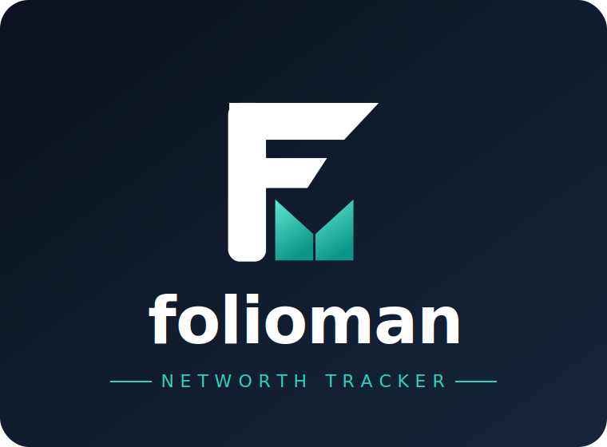
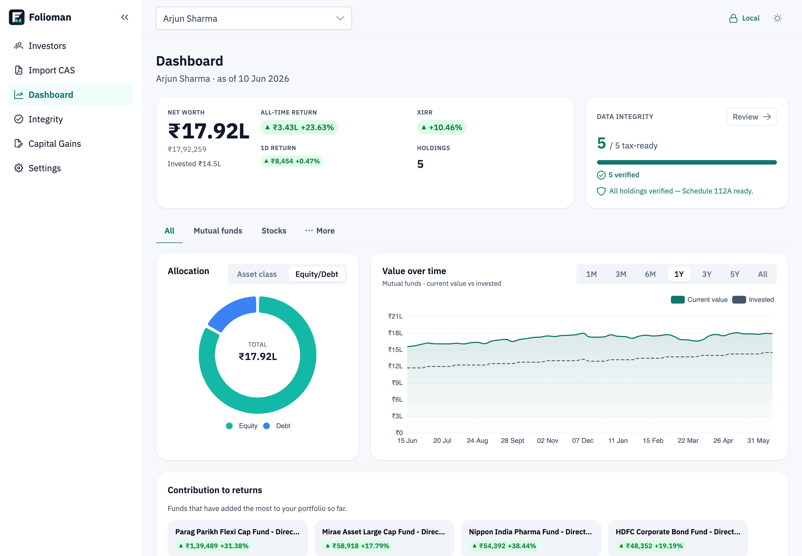
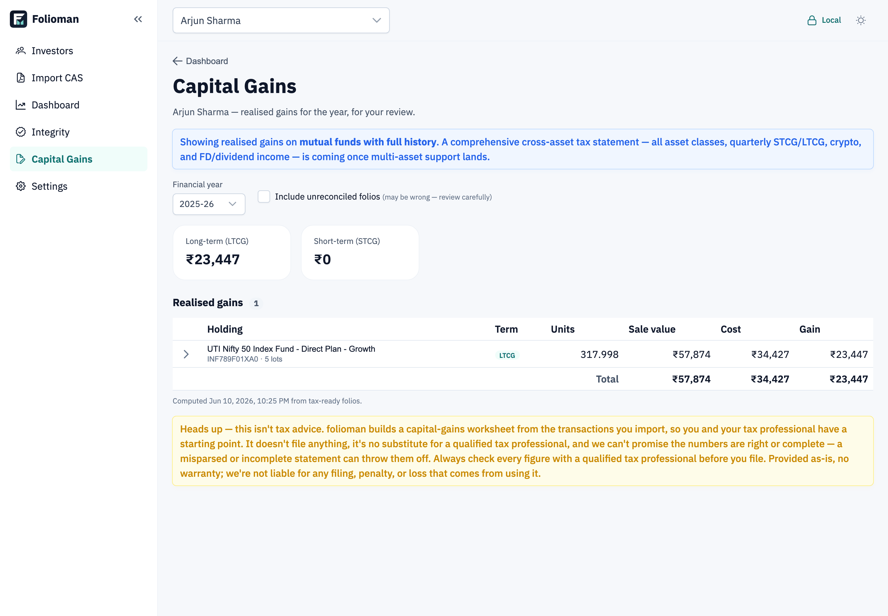
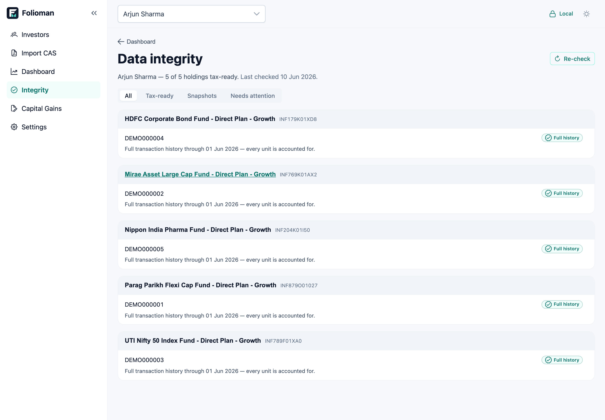
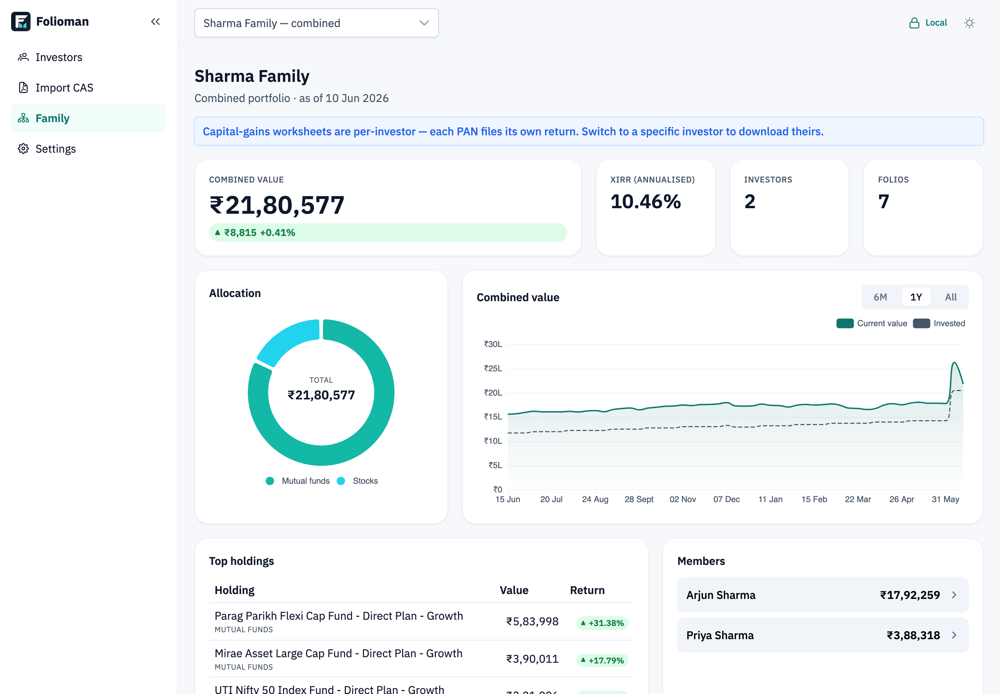

  

# Folioman

A private net-worth tracker and tax helper for Indian investors — runs on your own
computer or your own server.

> **Status: v1.0 — first stable release.**

## 👀 Try the live demo

Take Folioman for a spin — a sample five-year portfolio, no install required:

> **[folioman.atomcoder.com](https://folioman.atomcoder.com/)** — sign in with **`demo`** / **`demo-password`**

It's a **read-only** instance preloaded with example data (mutual funds, equities,
capital gains across a few years), so you can explore every screen freely. Imports
and edits are disabled.

## A look inside

| | |
|:---:|:---:|
| **Dashboard** — net worth, returns & allocation | **Capital gains** — a worksheet per financial year |
|  |  |
| **Data integrity** — every holding reconciled | **Family view** — everyone's portfolios, combined |
|  |  |

## What you get

- **All your investments in one place.** Import your mutual-fund CAS statement and
  see every folio and your total net worth together.
- **How your money is doing over time.** Charts of your portfolio's value and
  per-fund history.
- **A head start on taxes.** Build a capital-gains worksheet you can take to your
  tax advisor (see *Not tax advice* below).
- **Your data stays yours.** Everything lives on the machine you run it on —
  no account, no sign-up, nothing uploaded.

## Privacy & network

Folioman is **local-first**: no account, no sign-up, no analytics, and no
telemetry. Your CAS statements, holdings, transactions, and PANs live only where
the app runs (PANs are encrypted at rest), and **none of your data is ever sent
anywhere**.

To actually value your portfolio, though, the app fetches **public market and
reference data** over the network — never anything that identifies you:

| What | From | Sent | Privacy note |
|------|------|------|--------------|
| Mutual-fund NAVs | mfapi.in (AMFI data) | the fund's AMFI code | per-fund requests reveal *which* funds you hold to that service |
| ISIN / AMFI reference DB (casparser-isin) | casparser.atomcoder.com | nothing identifying | fetched as one whole file — reveals nothing about your holdings |
| Equities / crypto quotes *(planned)* | Yahoo / NSE / CoinGecko | the ticker / coin id | per-symbol requests, same holdings caveat as NAVs |

These requests carry **no account, no PAN, no portfolio** — only the public
symbol/code needed to price a holding. We prefer **bulk** feeds (the whole ISIN
DB, AMFI's full NAV file) over per-symbol calls precisely because they leak
nothing about what you own. The app still works **offline** — it values from your
last imported statement and the bundled reference data; prices just won't update.

## Ways to run Folioman

There are two ways to use Folioman. Pick the one that fits you:

### 1. On your own computer — *best for tracking your own or your family's portfolio*

A desktop app that runs entirely on your Mac, Windows, or Linux machine. There's
no one-click installer yet, so you set it up once from source (about five
commands).

➡️ **[Run Folioman on your own computer](BUILD.md)**

### 2. On a server you control — *best for hosting for a family or small team*

Run Folioman as a small web app on your own server or home machine using Docker,
and reach it from any browser.

➡️ **[Self-host Folioman with Docker](docs/install-docker.md)**

## Not tax advice

Folioman can build a **capital-gains worksheet** from the transactions you
import, to give you and your tax professional a starting point. That's all it is:

> Heads up — this isn't tax advice. The worksheet doesn't file anything, it's no
> substitute for a qualified tax professional, and we can't promise the numbers
> are right or complete — a misparsed or incomplete statement can throw them off.
> Always check every figure with a qualified tax professional before you file.
> Provided as-is, no warranty; we're not liable for any filing, penalty, or loss
> that comes from using it.

## License

Folioman is free and open source under the **GNU Affero General Public License
v3.0 or later** (see [`LICENSE`](LICENSE)). You're free to use, study, share, and
modify it; if you run a modified version as a network service, the AGPL asks you
to make your changes available to its users.

## For developers

Building from source, hacking on the code, or operating a server? The technical
reference lives in [`docs/developer/`](docs/developer/README.md).
